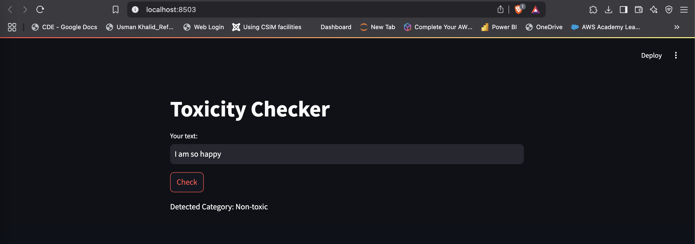
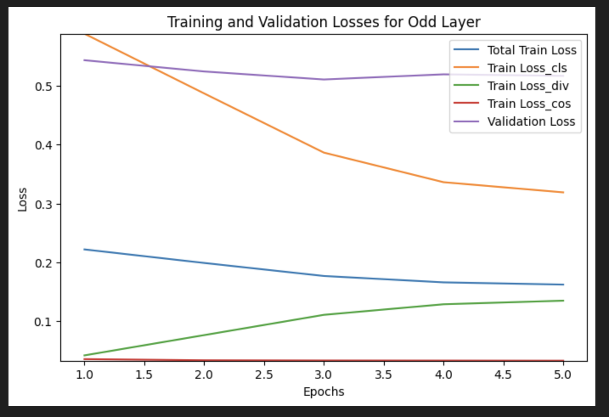
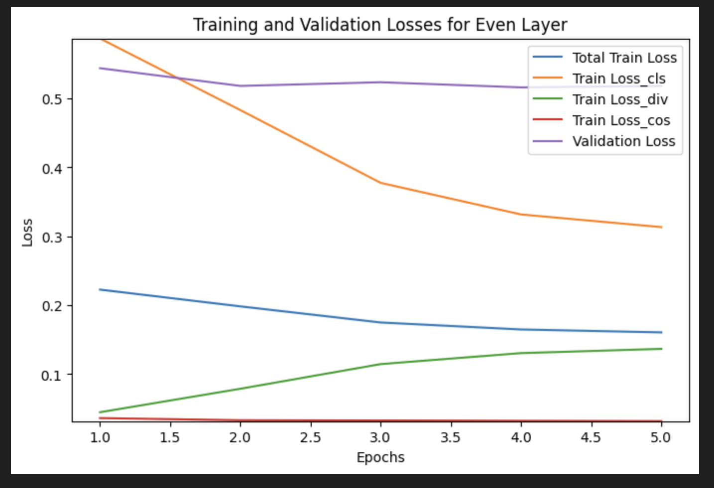

# Hate Speech Detection: Model Evaluation and Analysis

## Dataset Overview
This project utilizes the **wisnu001binus/Hate_Speech_Dataset** from Hugging Face for binary classification tasks. The dataset includes:

- **Input:** Text content for classification
- **Label:** 0 (Non-hate speech), 1 (Hate speech)
- **Preprocessing:** Tokenization with BERT (bert-base-uncased), max sequence length of 128
- **Data Splits:**
  - Training: 10,000 samples
  - Validation: 1,000 samples
  - Test: 1,000 samples

---

## Model Evaluation and Analysis
### Performance Comparison of Odd Layers, Even Layers, and LoRA Models
Three different training approaches were evaluated: Odd Layer, Even Layer, and LoRA-based fine-tuning. The performance metrics are summarized below:

| Model Type  | Training Loss | Test Set Accuracy |
|------------|--------------|------------------|
| Odd Layer  | 0.1618       | 0.7730           |
| Even Layer | 0.1606       | 0.7750           |
| LoRA       | 0.5391       | 0.7095           |

#### Observations:
- **Odd vs. Even Layer Models:** The Even Layer model demonstrated slightly better performance (77.50%) compared to the Odd Layer model (77.30%), but the difference is marginal. This suggests that knowledge transfer is relatively balanced between odd and even layers.
- **LoRA Model:** While LoRA significantly reduces the number of parameters, it results in a noticeable drop in performance, achieving 70.95% accuracy with a higher loss (0.5391). This indicates a trade-off between computational efficiency and model effectiveness.

### Challenges and Proposed Improvements

#### Challenges in Distillation Fine-Tuning (Odd/Even Layers)
- Aligning teacher-student knowledge transfer efficiently across layers.
- Balancing multiple loss terms during optimization.
- Ensuring proper gradient flow across layers to maintain learning stability.

#### Challenges in LoRA Fine-Tuning
- Selecting the appropriate rank for different layers to maintain performance.
- Identifying target modules for parameter-efficient adaptation.
- Managing training stability when reducing parameters significantly.

#### Proposed Improvements
- **For Odd/Even Layer Models:** Implement automated hyperparameter tuning (e.g., Bayesian optimization) to improve convergence and optimize performance.
- **For LoRA:** Use mixed-precision training to speed up convergence and reduce memory footprint. Experimenting with different adapter placements could also help improve performance.
- **General Enhancements:** Apply ensemble techniques to combine multiple models for more robust predictions.

## Web Application Screenshots  
Here are sample screenshots showcasing the classification results:  

### Toxic Example  
  

### Non-Toxic Example  
  

## Model Performance Graph  
Below is a comparison of the performance of Odd vs. Even Layer models:  
### Odd
  
### Even
  

